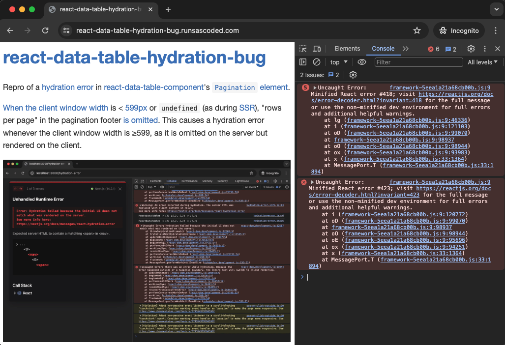
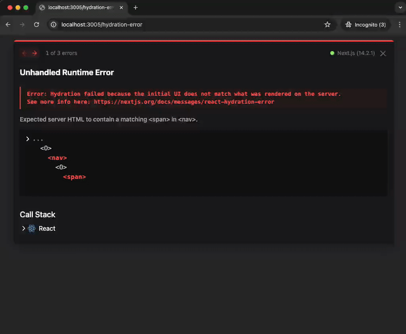
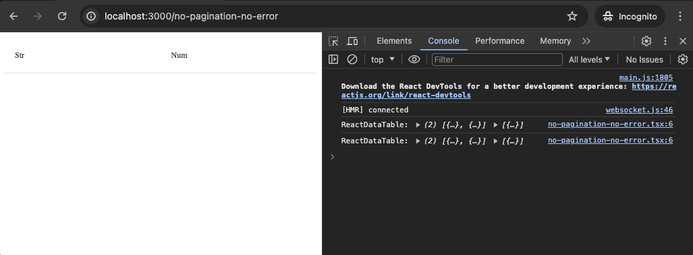

# react-data-table-hydration-bug
Repro of a hydration error ([react#418]) in [react-data-table-component]'s pagination `<nav>` element.

<!-- toc -->
- [Local repro](#local)
- [`pagination={false}` works fine](#no-pagination)
- [Docker repro](#docker)
<!-- /toc -->

## Live demo <a id="demo"></a>
[react-data-table-hydration-bug.runsascoded.com/hydration-error] was built and deployed [via Github Actions][GHA], and the error is visible in the dev console:



Page source is [hydration-error.tsx], it's just:

```tsx
import DataTable from "react-data-table-component"

export default function TablePage() {
  const columns = [ { name: "Str" }, { name: "Num" } ]
  const data = [ { Str: "A", Num: 1 } ]
  return (
      <DataTable
          columns={columns}
          data={data}
          // This line causes a hydration error in the pagination footer "nav" element; commenting
          // this line fixes it (see no-pagination-no-error.tsx)
          pagination
      />
  )
}
```

Error links to [react#418], console message says:
```
Uncaught Error: Minified React error #418; visit https://reactjs.org/docs/error-decoder.html?invariant=418 for the full message or use the non-minified dev environment for full errors and additional helpful warnings.
    at lg (framework-5eea1a21a68cb00b.js:9:46336)
    at i (framework-5eea1a21a68cb00b.js:9:121103)
    at oD (framework-5eea1a21a68cb00b.js:9:99070)
    at framework-5eea1a21a68cb00b.js:9:98937
    at oO (framework-5eea1a21a68cb00b.js:9:98944)
    at ox (framework-5eea1a21a68cb00b.js:9:93983)
    at x (framework-5eea1a21a68cb00b.js:33:1364)
    at MessagePort.T (framework-5eea1a21a68cb00b.js:33:1894)
```

## Local repro <a id="local"></a>
Local dev mode gives more details about the error, which apparently occurs in a hierarchy like `<nav>…<span>` in [the pagination footer][PaginationWrapper]:

```bash
git clone https://github.com/ryan-williams/react-data-table-hydration-bug && cd react-data-table-hydration-bug
pnpm install
npm run dev
```

[localhost:3000/hydration-error] *should* show something like:


<details><summary>Error text</summary>

```
Unhandled Runtime Error
Error: Hydration failed because the initial UI does not match what was rendered on the server.
See more info here: https://nextjs.org/docs/messages/react-hydration-error

Expected server HTML to contain a matching <span> in <nav>.

...
  <O>
    <nav>
    ^^^^^
      <O>
        <span>
        ^^^^^^
```
</details>

### Having Chrome devtools open prevents the error

Here is a screencast of an incognito showing repeated page refreshes, with and without Chrome devtools open:



The error always occurs when devtools are closed, and never occurs when they are open.

In Safari and Firefox, and with non-dev builds, devtools doesn't seem to affect the repro.

### `pagination={false}` works fine <a id="no-pagination"></a>

[localhost:3000/no-pagination-no-error] is identical to [hydration-error.tsx] above, but [`DataTable`]'s `pagination` property is commented out, removing the error:



`diff -u pages/hydration-error.tsx pages/no-pagination-no-error.tsx` shows:
```diff
       <DataTable
           columns={columns}
           data={data}
-          // This line causes a hydration error in the pagination footer "nav" element; commenting
-          // this line fixes it (see no-pagination-no-error.tsx)
-          pagination
+          // Uncommenting this line causes a hydration error in the pagination footer "nav"
+          // element (see hydration-error.tsx)
+          // pagination
       />
```

[This StackOverflow][SO] alludes to the same issue.

## Docker repro <a id="docker"></a>
Run in dev mode (in Docker):
```bash
# Build
img=react-data-table-hydration-bug
docker build -t $img .

# Run
PORT=3001
docker run --rm -it -p $PORT:3000 $img
```

As above, [localhost:3001/hydration-error] may show a hydration error, while [localhost:3001/no-pagination-no-error] will not.

This has reproduced the issue for me locally 3 of 3 attempts (re-building the Docker image using `--no-cache`).

To test a built+exported static app in Docker:
```bash
docker run -it --rm --entrypoint http-server -p $PORT:3000 $img -p 3000 out
```
As above, [localhost:3001/hydration-error] may show a hydration error, though in this case it will only appear in the browser dev-tools console, and will be minified.

This form has not reproduced the issue for me locally. Analogous build+`http-server` test directly on host has exhibited the error.

[react-data-table-component]: https://github.com/jbetancur/react-data-table-component
[localhost:3000/hydration-error]: http://localhost:3000/hydration-error
[localhost:3000/no-pagination-no-error]: http://localhost:3000/no-pagination-no-error
[`DataTable`]: https://github.com/jbetancur/react-data-table-component/blob/v7.6.2/src/DataTable/DataTable.tsx
[SO]: https://stackoverflow.com/q/75068071
[localhost:3001/hydration-error]: http://localhost:3001/hydration-error
[localhost:3001/no-pagination-no-error]: http://localhost:3001/no-pagination-no-error

[react#418]: https://react.dev/errors/418?invariant=418

[react-data-table-hydration-bug.runsascoded.com/hydration-error]: https://react-data-table-hydration-bug.runsascoded.com/hydration-error
[hydration-error.tsx]: pages/hydration-error.tsx
[GHA]: https://github.com/runsascoded/react-data-table-hydration-bug/actions
[PaginationWrapper]: https://github.com/jbetancur/react-data-table-component/blob/v7.6.2/src/DataTable/Pagination.tsx#L20C7-L30
