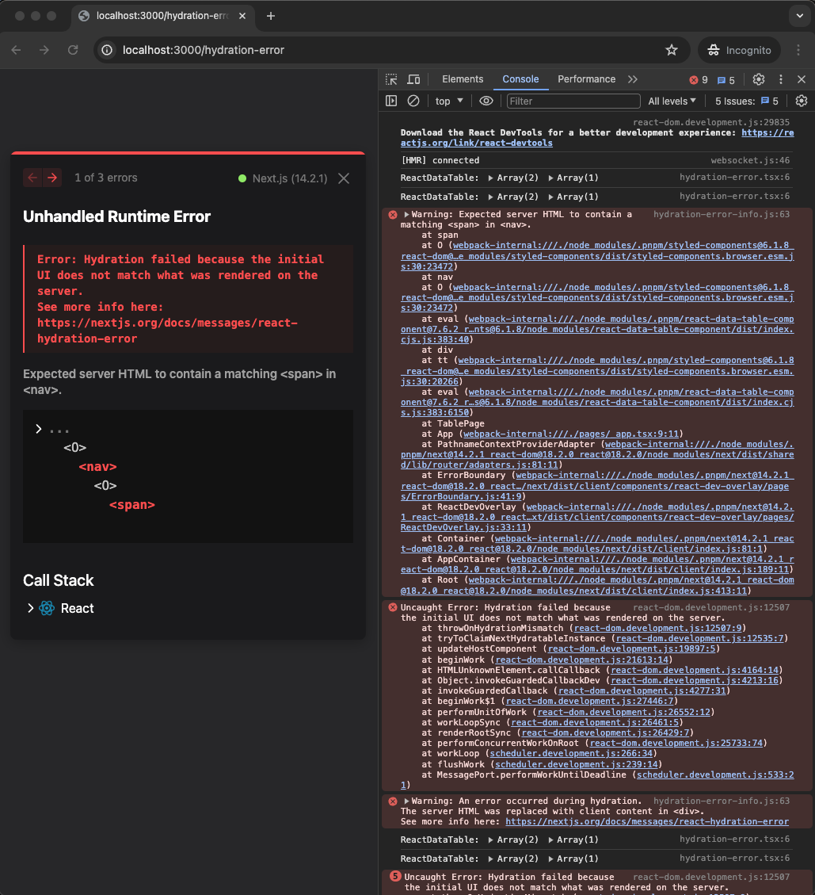
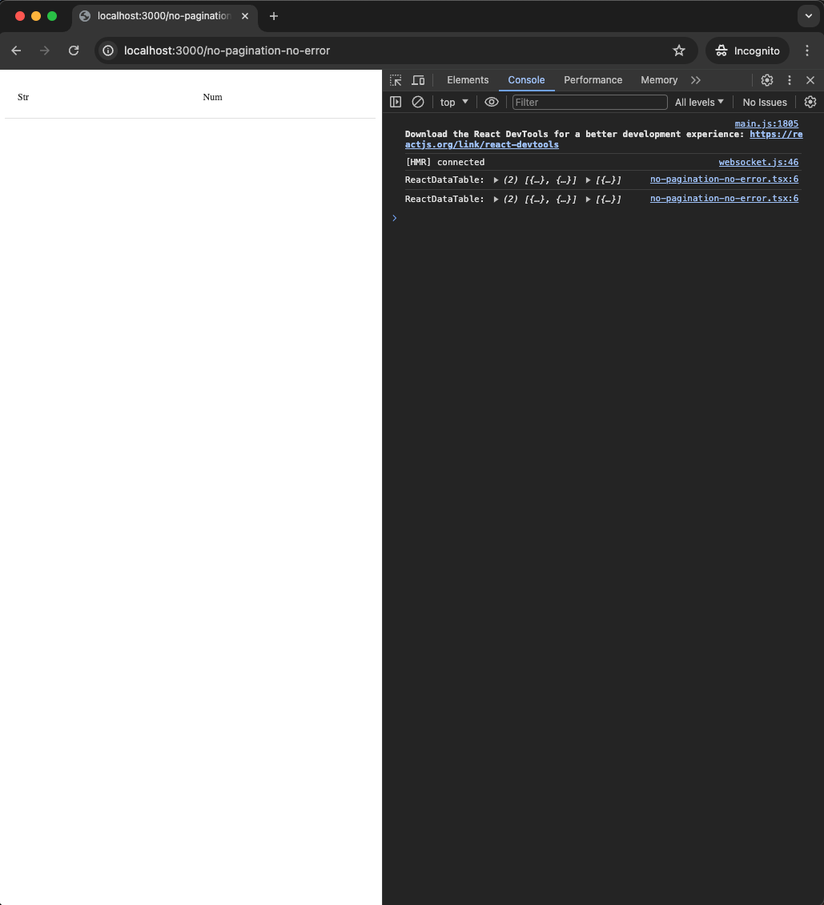

# react-data-table-hydration-bug
Repro of a hydration error in [react-data-table-component]'s pagination `<nav>` element.

<!-- toc -->
- [Local repro](#local)
- [`pagination={false}` works fine](#no-pagination)
- [Docker repro](#docker)
<!-- /toc -->

## Local repro <a id="local"></a>
<details><summary>Clone repo</summary>

```bash
git clone https://github.com/ryan-williams/react-data-table-hydration-bug
cd react-data-table-hydration-bug
```
</details>

Install/Build/Run:
```bash
pnpm install
npm run dev
```

Then visit [localhost:3000/hydration-error] in your browser (port may differ if 3000 is blocked).

You **may** see something like:



It doesn't always happen; it seems like something during the build process may be nondeterministic. From what I can tell, some `next dev` / `next build` deploys will always exhibit the issue, and it can persist across rebuilds, but on other rebuilds it will go away, (and stay away across rebuilds).

I've tried various configurations (browser console "Disable cache", different Chrome profiles / refreshes, clean builds, etc.) but haven't figured out why the error sometimes occurs, and sometimes doesn't.

## `pagination={false}` works fine <a id="no-pagination"></a>

[localhost:3000/no-pagination-no-error] is the same page, with [`DataTable`]'s `pagination` property commented out, and the error is not present:



`diff -u pages/hydration-error.tsx pages/no-pagination-no-error.tsx` shows:
```diff
       <DataTable
           columns={columns}
           data={data}
-          // This line causes a hydration error in the pagination footer "nav" element; commenting
-          // this line fixes it (see no-pagination-no-error.tsx)
-          pagination
+          // Uncommenting this line causes a hydration error in the pagination footer "nav"
+          // element (see hydration-error.tsx)
+          // pagination
       />
```

[This StackOverflow][SO] alludes to the same issue.

## Docker repro <a id="docker"></a>
```bash
img=react-data-table-hydration-bug
docker build -t $img .

PORT=3001
docker run --rm -it -p $PORT:3000 $img
```

As above, [localhost:3001/hydration-error] may show a hydration error, while [localhost:3001/no-pagination-no-error] will not.

This has reproduced the issue for me locally 3 of 3 attempts (re-building the Docker image using `--no-cache`).

[react-data-table-component]: https://github.com/jbetancur/react-data-table-component
[localhost:3000/hydration-error]: http://localhost:3000/hydration-error
[localhost:3000/no-pagination-no-error]: http://localhost:3000/no-pagination-no-error
[`DataTable`]: https://github.com/jbetancur/react-data-table-component/blob/v7.6.2/src/DataTable/DataTable.tsx
[SO]: https://stackoverflow.com/q/75068071
[localhost:3001/hydration-error]: http://localhost:3001/hydration-error
[localhost:3001/no-pagination-no-error]: http://localhost:3001/no-pagination-no-error
